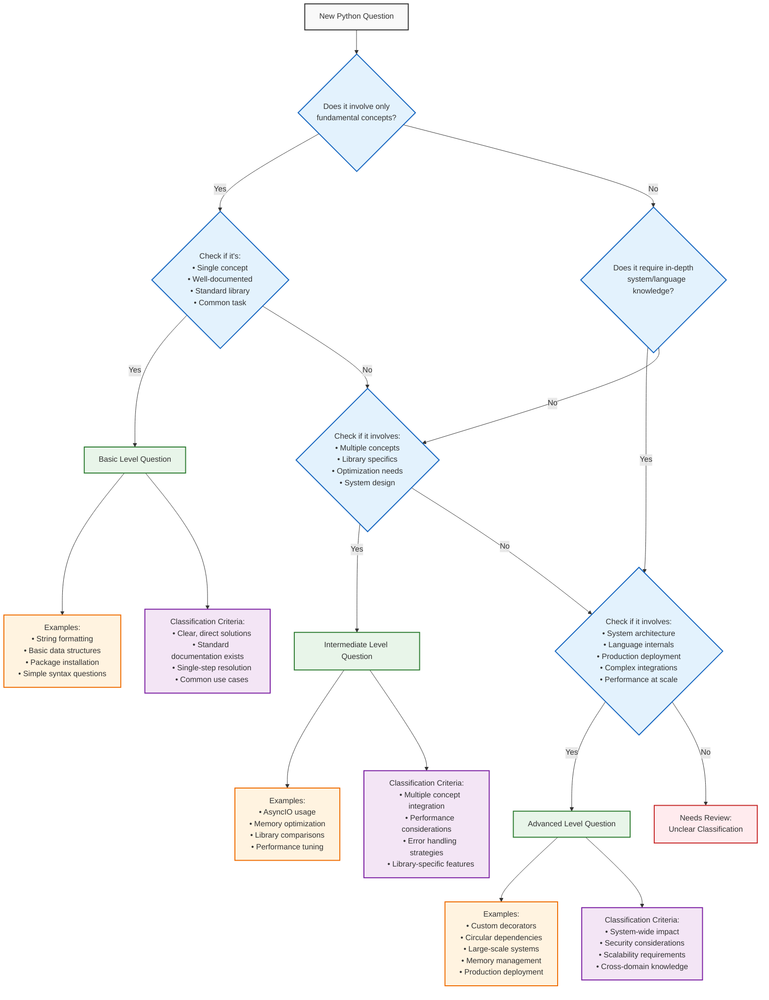

```mermaid
flowchart TD
    Start["New Python Question"]
    
    %% Initial Assessment
    D1{"Does it involve only
    fundamental concepts?"}
    
    Start --> D1
    
    %% Basic Path
    D1 -->|Yes| B1{"Check if it's:
    • Single concept
    • Well-documented
    • Standard library
    • Common task"}
    
    B1 -->|Yes| Basic["Basic Level Question"]
    
    Basic --> BE["Examples:
    • String formatting
    • Basic data structures
    • Package installation
    • Simple syntax questions"]
    
    %% Advanced Check
    D1 -->|No| D2{"Does it require in-depth
    system/language knowledge?"}
    
    %% Advanced Path
    D2 -->|Yes| A1{"Check if it involves:
    • System architecture
    • Language internals
    • Production deployment
    • Complex integrations
    • Performance at scale"}
    
    A1 -->|Yes| Advanced["Advanced Level Question"]
    
    Advanced --> AE["Examples:
    • Custom decorators
    • Circular dependencies
    • Large-scale systems
    • Memory management
    • Production deployment"]
    
    %% Intermediate Path
    D2 -->|No| I1{"Check if it involves:
    • Multiple concepts
    • Library specifics
    • Optimization needs
    • System design"}
    
    I1 -->|Yes| Intermediate["Intermediate Level Question"]
    
    Intermediate --> IE["Examples:
    • AsyncIO usage
    • Memory optimization
    • Library comparisons
    • Performance tuning"]
    
    %% Edge Cases
    B1 -->|No| I1
    I1 -->|No| A1
    A1 -->|No| Review["Needs Review:
    Unclear Classification"]
    
    %% Additional Criteria Boxes
    Basic --> BC["Classification Criteria:
    • Clear, direct solutions
    • Standard documentation exists
    • Single-step resolution
    • Common use cases"]
    
    Intermediate --> IC["Classification Criteria:
    • Multiple concept integration
    • Performance considerations
    • Error handling strategies
    • Library-specific features"]
    
    Advanced --> AC["Classification Criteria:
    • System-wide impact
    • Security considerations
    • Scalability requirements
    • Cross-domain knowledge"]
    
    %% Styling
    classDef default fill:#f9f9f9,stroke:#333,stroke-width:2px;
    classDef decision fill:#e3f2fd,stroke:#1565c0,stroke-width:2px;
    classDef level fill:#e8f5e9,stroke:#2e7d32,stroke-width:2px;
    classDef example fill:#fff3e0,stroke:#ef6c00,stroke-width:2px;
    classDef criteria fill:#f3e5f5,stroke:#7b1fa2,stroke-width:2px;
    classDef review fill:#ffebee,stroke:#c62828,stroke-width:2px;
    
    class Start default;
    class D1,D2,B1,I1,A1 decision;
    class Basic,Intermediate,Advanced level;
    class BE,IE,AE example;
    class BC,IC,AC criteria;
    class Review review;
```

Basic → Intermediate → Advanced
--------------------------------
Syntax → Concepts → Architecture
Usage → Integration → Design
Simple → Complex → System-wide