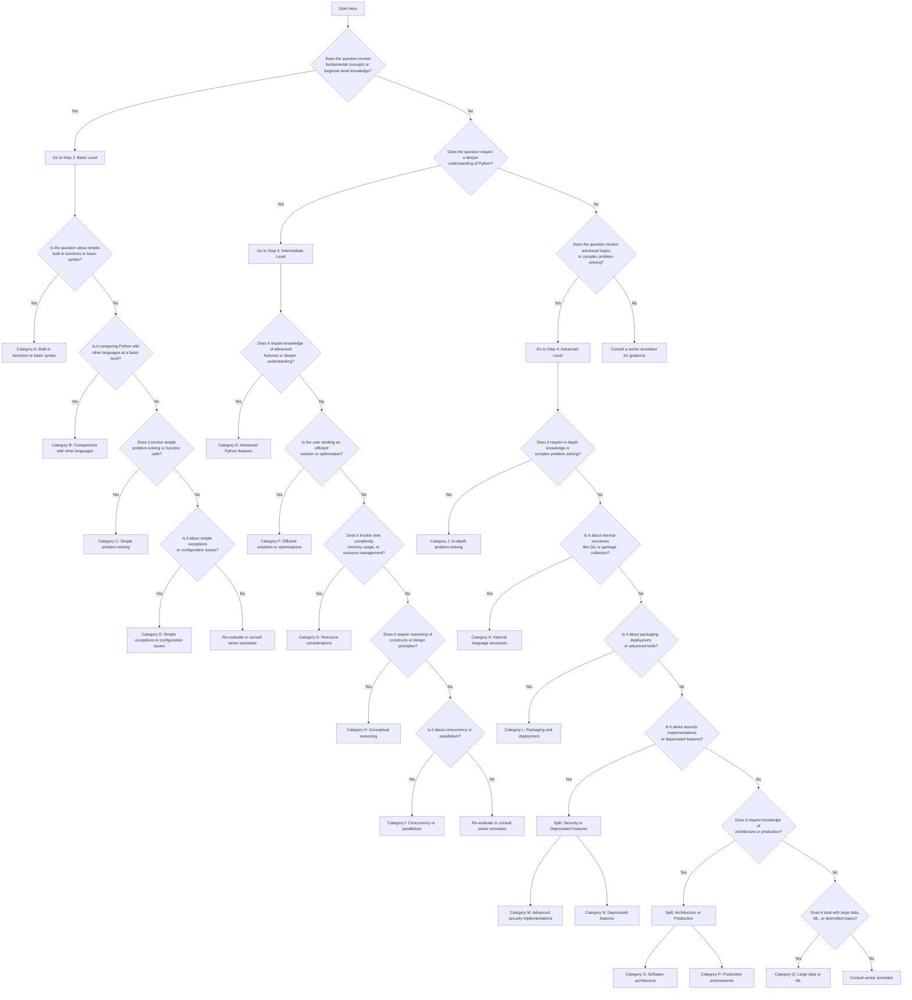

```mermaid
flowchart TD
    Start[Start Here] --> Q1{Does the question involve\nfundamental concepts or beginner-level knowledge?}
    Q1 -->|Yes| Step2[Go to Step 2: Basic Level]
    Q1 -->|No| Q2{Does the question require a deeper\nunderstanding of Python?}
    Q2 -->|Yes| Step3[Go to Step 3: Intermediate Level]
    Q2 -->|No| Q3{Does the question involve advanced topics\nor complex problem-solving?}
    Q3 -->|Yes| Step4[Go to Step 4: Advanced Level]
    Q3 -->|No| Consult[Consult a senior annotator for guidance]

    Step2 --> S2Q1{Is the question about simple\nbuilt-in functions or basic syntax?}
    S2Q1 -->|Yes| CatA[Category A: Built-in functions or basic syntax]
    S2Q1 -->|No| S2Q2{Is it comparing Python with\nother languages at a basic level?}
    S2Q2 -->|Yes| CatB[Category B: Comparisons with other languages]
    S2Q2 -->|No| S2Q3{Does it involve simple\nproblem-solving or function calls?}
    S2Q3 -->|Yes| CatC[Category C: Simple problem-solving]
    S2Q3 -->|No| S2Q4{Is it about simple exceptions\nor configuration issues?}
    S2Q4 -->|Yes| CatD[Category D: Simple exceptions or configuration issues]
    S2Q4 -->|No| ConsultStep2[Re-evaluate or consult senior annotator]

    Step3 --> S3Q1{Does it require knowledge of advanced\nfeatures or deeper understanding?}
    S3Q1 -->|Yes| CatE[Category E: Advanced Python features]
    S3Q1 -->|No| S3Q2{Is the user seeking an efficient\nsolution or optimization?}
    S3Q2 -->|Yes| CatF[Category F: Efficient solutions or optimizations]
    S3Q2 -->|No| S3Q3{Does it involve time complexity,\nmemory usage, or resource management?}
    S3Q3 -->|Yes| CatG[Category G: Resource considerations]
    S3Q3 -->|No| S3Q4{Does it require reasoning of\nconstructs or design principles?}
    S3Q4 -->|Yes| CatH[Category H: Conceptual reasoning]
    S3Q4 -->|No| S3Q5{Is it about concurrency or parallelism?}
    S3Q5 -->|Yes| CatI[Category I: Concurrency or parallelism]
    S3Q5 -->|No| ConsultStep3[Re-evaluate or consult senior annotator]

    Step4 --> S4Q1{Does it require in-depth knowledge or\ncomplex problem-solving?}
    S4Q1 -->|Yes| CatJ[Category J: In-depth problem-solving]
    S4Q1 -->|No| S4Q2{Is it about internal structures\nlike GIL or garbage collection?}
    S4Q2 -->|Yes| CatK[Category K: Internal language structures]
    S4Q2 -->|No| S4Q3{Is it about packaging, deployment,\nor advanced tools?}
    S4Q3 -->|Yes| CatL[Category L: Packaging and deployment]
    S4Q3 -->|No| S4Q4{Is it about security implementations\nor deprecated features?}
    S4Q4 -->|Yes| SplitSec[Split: Security or Deprecated Features]
    SplitSec --> CatM[Category M: Advanced security implementations]
    SplitSec --> CatN[Category N: Deprecated features]
    S4Q4 -->|No| S4Q5{Does it require knowledge of\narchitecture or production?}
    S4Q5 -->|Yes| SplitArch[Split: Architecture or Production]
    SplitArch --> CatO[Category O: Software architecture]
    SplitArch --> CatP[Category P: Production environments]
    S4Q5 -->|No| S4Q6{Does it deal with large data,\nML, or diversified topics?}
    S4Q6 -->|Yes| CatQ[Category Q: Large data or ML]
    S4Q6 -->|No| ConsultStep4[Consult senior annotator]

```