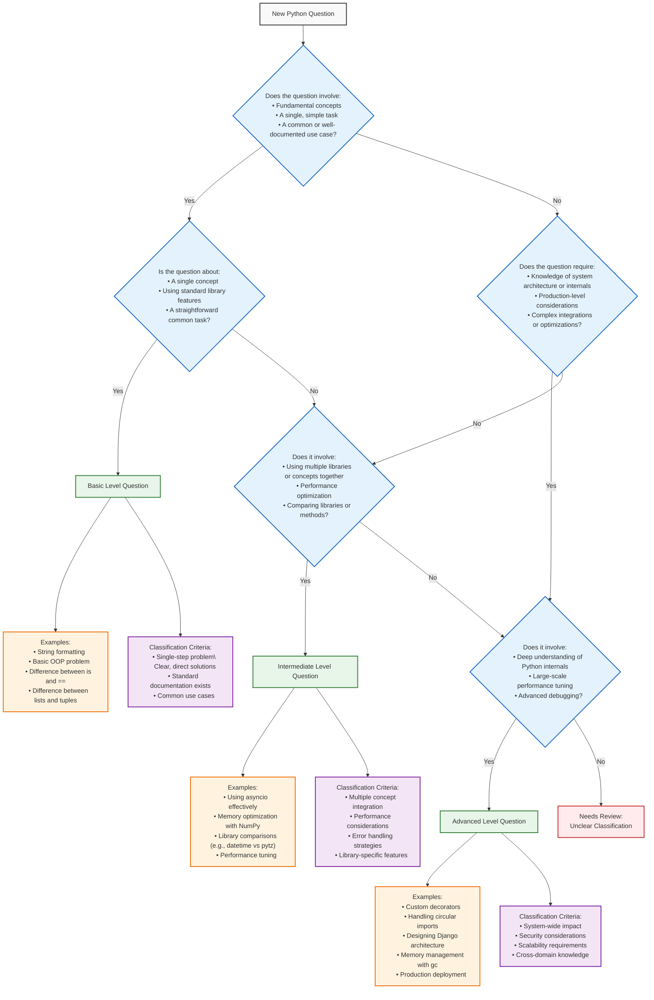

```mermaid
flowchart TD
    Start["New Python Question"]
    
    %% Initial Assessment
    D1{"Does the question involve:
    • Fundamental concepts
    • A single, simple task
    • A common or well-documented use case?"}
    
    Start --> D1
    
    %% Basic Path
    D1 -->|Yes| B1{"Is the question about:
    • A single concept
    • Using standard library features
    • A straightforward common task?"}
    
    B1 -->|Yes| Basic["Basic Level Question"]
    
    Basic --> BE["Examples:
    • String formatting
    • Basic OOP problem
    • Difference between is and ==
    • Difference between lists and tuples"]
    
    %% Advanced Check
    D1 -->|No| D2{"Does the question require:
    • Knowledge of system architecture or internals
    • Production-level considerations
    • Complex integrations or optimizations?"}
    
    %% Advanced Path
    D2 -->|Yes| A1{"Does it involve:
    • Deep understanding of Python internals
    • Large-scale performance tuning
    • Advanced debugging?"}
    
    A1 -->|Yes| Advanced["Advanced Level Question"]
    
    Advanced --> AE["Examples:
    • Custom decorators
    • Handling circular imports
    • Designing Django architecture
    • Memory management with gc
    • Production deployment"]
    
    %% Intermediate Path
    D2 -->|No| I1{"Does it involve:
    • Using multiple libraries or concepts together
    • Performance optimization
    • Comparing libraries or methods?"}
    
    I1 -->|Yes| Intermediate["Intermediate Level Question"]
    
    Intermediate --> IE["Examples:
    • Using asyncio effectively
    • Memory optimization with NumPy
    • Library comparisons (e.g., datetime vs pytz)
    • Performance tuning"]
    
    %% Edge Cases
    B1 -->|No| I1
    I1 -->|No| A1
    A1 -->|No| Review["Needs Review:\nUnclear Classification"]
    
    %% Additional Criteria Boxes
    Basic --> BC["Classification Criteria:
    • Single-step problem\
     Clear, direct solutions
    • Standard documentation exists
    • Common use cases"]
    
    Intermediate --> IC["Classification Criteria:
    • Multiple concept integration
    • Performance considerations
    • Error handling strategies
    • Library-specific features"]
    
    Advanced --> AC["Classification Criteria:
    • System-wide impact
    • Security considerations
    • Scalability requirements
    • Cross-domain knowledge"]
    
    %% Styling
    classDef default fill:#f9f9f9,stroke:#333,stroke-width:2px;
    classDef decision fill:#e3f2fd,stroke:#1565c0,stroke-width:2px;
    classDef level fill:#e8f5e9,stroke:#2e7d32,stroke-width:2px;
    classDef example fill:#fff3e0,stroke:#ef6c00,stroke-width:2px;
    classDef criteria fill:#f3e5f5,stroke:#7b1fa2,stroke-width:2px;
    classDef review fill:#ffebee,stroke:#c62828,stroke-width:2px;
    
    class Start default;
    class D1,D2,B1,I1,A1 decision;
    class Basic,Intermediate,Advanced level;
    class BE,IE,AE example;
    class BC,IC,AC criteria;
    class Review review;
```